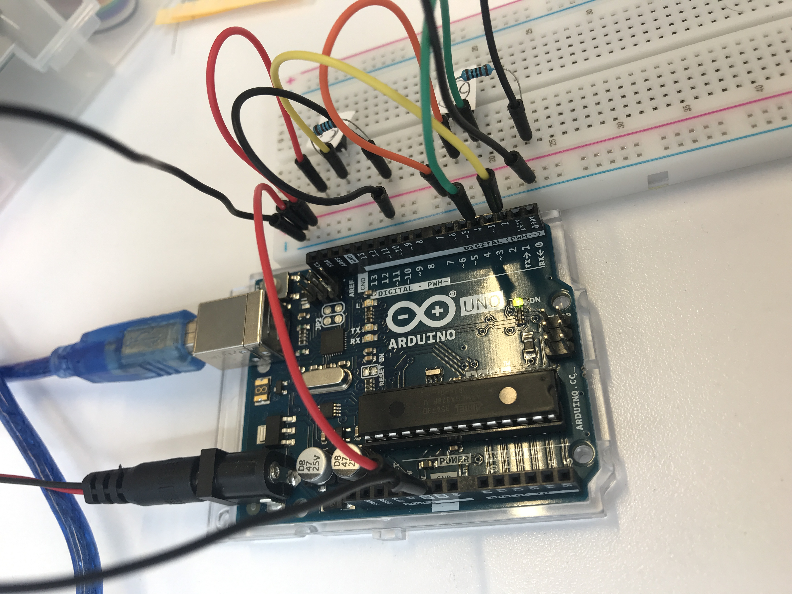
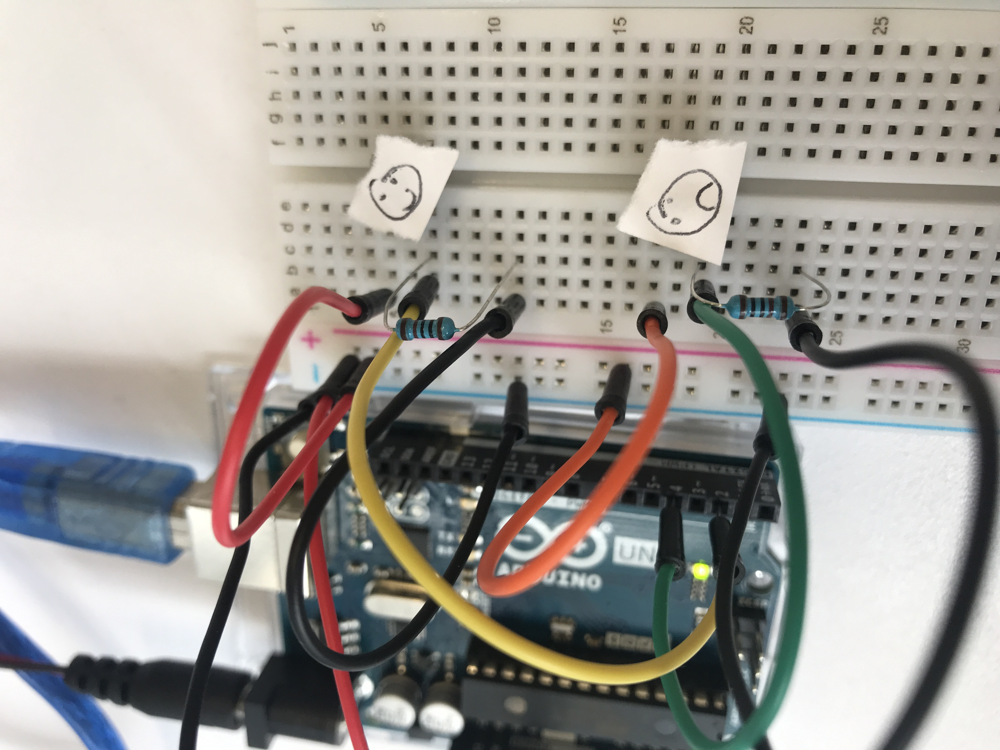

# Exploring the world of nodebots


## The Tech Inspiration

I was listening to the [Code Newbie Podcast](https://www.codenewbie.org/podcast) episode about [node bots](https://www.codenewbie.org/podcast/how-do-you-build-a-robot-in-javascript) with [Rachel White](http://rachelisaweso.me/) and was inspired as she was saying how simple it was to start building robots if you knew javascript. Which was felt accessible to me at the time because it was the first programming language that I had first picked up when learning how to code.

## The Real Life Inspiration

One day, when leaving my daughters with a new babysitter, my oldest, who was 6 at the time was really nervous about it and didn’t want us to go. Before the babysitter came, I told her that we could create a secret password to pass through the babysitter without him knowing. I said that we could tell the babysitter that my partner and I were going to go grocery shopping and my daughter was going to think about the type of fruit she was wanting us pick up. But the secret password was, that if she was having a really hard time and needed us to come home she could tell the babysitter to text us saying she wanted “bananas” (a fruit my daughter doesn’t like) but if she was having a great time and didn’t need us to come home she could text us and say she wanted “kiwi” (one of my daughters favorite fruit).

Bad time = “bananas” Good time = “kiwi”

## How tech and life came together

This interaction inspired me to think, what if I could have left my daughter with some kind of a device so that she could text me with an emoji how she was doing as opposed to going through the babysitter? Maybe the two options could be :smiley: or :cry:?

So the idea of the **Sloane Phone** was born.

_By the way, Sloane wanted “kiwi’s”._

## Project Plan

### Experience so far:

- I purchased an [Arduino Uno](https://store.arduino.cc/usa/arduino-uno-rev3) ($22) board online, and after realizing I had no way to plug it into my computer also bought a [Freenove Starter Kit](https://www.amazon.com.au/Freenove-Processing-Oscilloscope-Voltmeter-Components/dp/B0721B8228/ref=sr_1_1?keywords=freenove+arduino+uno+starter+kit&qid=1576150765&s=electronics&sr=1-1) ($34) as well.
- I familiarized myself with [Arduino Uno projects](https://electronicsforu.com/arduino-projects-ideas) to see what’s [possible](https://howtomechatronics.com/arduino-projects/) in [general](https://circuitdigest.com/arduino-projects).
- I googled some youtube video’s on how to connect a board and make it into a phone
- I attended a saturday’s hackers session at [Connected Community Hackerspace](https://www.hackmelbourne.org/) where I learned the basics of [Ohm’s Law](https://en.wikipedia.org/wiki/Ohm%27s_law) (electricity) and saw people building and driving around machine learning car robots.
- There I did the “hello world” of arduino boards and made an led light turn on through the circuit board
- I’ve looked through the Arduino library for some examples of different projects to build but realized they’re in C++ and I’m wanting to use node.js

### Next steps:

- I understand that [Johnny-Five](http://johnny-five.io/) is a great site for documentation and the community is really friendly so I’ll try and start there as a guide
  - I join the [Gitter chat group](https://gitter.im/rwaldron/johnny-five) for more support
- I was also referred to [Node-Ardx](http://node-ardx.org/) as a place for node.bot newbies to start from people at Hackerspace Melbourne.
- Figure out all the hardware I need and what I need to purchase, I believe I need a [GSM](https://www.arduino.cc/en/Guide/ArduinoGSMShield) (\$40 (and this hobby is starting to get expensive))

### Schedule:

- Day 1
  - Set up node.js using the Johnny5 tutorials, configure any necessary settings
    - Use the [getting started wiki](https://github.com/rwaldron/johnny-five/wiki/Getting-Started)
  - Do the first couple of exercises from [Node-Ardx](http://node-ardx.org/) site
- Day 2
  - Do a couple more tutorials and more research on the phone to figure out what direction I would go next - if a phone would be too hard or if I needed to do something on a smaller scale, for example, working with a button controlled servo that could turn and say “did you indent?”
- Day 3
  - Build
- Day 4
  - If I haven’t done so already, write my own code (instead of finding other library code) on the project to use javascript with functions, looping, and conditional statements. Research things like “[navigator.vibrate(200)](https://developer.mozilla.org/en-US/docs/Web/API/Navigator/vibrate)” to see if phone commands could possibly work and why or why not?
- Day 5
  - Prepare to present. Possibly on this day work on the “ux” of the hardware design to make it a bit more sleek - or decide if I want to create a client side interface

### Bonus Features:

- GPS tracking possibly using a [Hologram SIM card](https://hologram.io/store/)
- Attach an [LCD display](https://www.arduino.cc/en/Tutorial/HelloWorld) so I can send messages back

## How to start a NodeBot project

Download the [Arduino IDE](https://www.arduino.cc/en/main/software)

Go to the [Johnn-Five website](http://johnny-five.io/). And follow their "Hello World!" steps. Step 2, setup your board, was tricky for me. I first went to this site that they refer you to([Firmata Arduino Github](https://github.com/firmata/arduino)) but found this page on Instructables to download [Standard Firmata](https://www.instructables.com/id/Arduino-Installing-Standard-Firmata/
http://firmata.org/wiki/Main_Page) the screenshots easier to follow.

I also ran into issues with my OS not allowing me to install the test from an unidentified developer, so this site was helpful on unlocking me security settings. [How to install programs from unidentified developers](https://kb.wisc.edu/25443)

Install [node-gyp](https://github.com/nodejs/node-gyp) which "is a cross-platform command-line tool written in Node.js for compiling native addon modules for Node.js."
`npm install -g node-gyp`

Make a directory
Create a node project
`node init`

Install the Johnny-Five dependency
`npm install johnny-five`

Create a new file
`touch blink.js`

Copy and paste the following into your blink.js file:

```
const {Board, Led} = require("johnny-five");
const board = new Board();

board.on("ready", () => {
  const led = new Led(13);
  led.blink(500);
});
```

Insert the shorter end of your led light into "GND" (which is short for ground) and the longer end into "13".

Plug the arduino into the computer using the USB.

Then in the terminal:
`node blink.js`

## How to make a button controlled servo with a led-matrix condition

Familiarize yourself with the Johnny-Five [servo docs](http://johnny-five.io/examples/servo/) and the [led-matrix docs](http://johnny-five.io/examples/led-matrix/).

The led-matrix was a bit tricky for me to set up. I needed to buy one with the [MAX7219](https://core-electronics.com.au/max7219-serial-dot-matrix-display-module.html?utm_source=google_shopping&gclid=Cj0KCQiA89zvBRDoARIsAOIePbAXJEz5XoxHO6AphZslLSmZa0pKvgWOEl_RVlhKaETziobAFN6c6OoaAh0bEALw_wcB). Also, pay attention to where the "GND" "VCC" "CS" etc. are written as I noticed different boards had them in different places and if you're a newbie like me, you will follow the instructions without looking at what is what.

With the base understanding of ground and volt, I wired both the servo and matrix through a breadboard:

I then took the code from the led-matrix docs and added it to the "up-button" condition statement:

```
//for servo
const {Board, Servo} = require("johnny-five");
const keypress = require("keypress");
keypress(process.stdin);
const board = new Board();
//for matrix (may not need both?)
var five = require("johnny-five");
// is this a problem that there are two boards?
// var board = new five.Board();

board.on("ready", function() {
  // insert code for servo
  console.log("Use Up and Down arrows for CW and CCW respectively. Space to stop.");

  const servo = new Servo.Continuous(10);

  process.stdin.resume();
  process.stdin.setEncoding("utf8");
  process.stdin.setRawMode(true);

  process.stdin.on("keypress", (ch, key) => {

    if (!key) {
      return;
    }

    if (key.name === "q") {
      console.log("Quitting");
      process.exit();
    } else if (key.name === "up") {
      console.log("CW");
      servo.cw();

      var matrix = new five.Led.Matrix({
        pins: {
          data: 2,
          clock: 3,
          cs: 4
        }
      });

      matrix.on();

      var msg = " NOW".split("");

      // Display each letter for 2 seconds
      function next() {
        var c;

        if (c = msg.shift()) {
          matrix.draw(c);
          setTimeout(next, 2000);
        }
      }

      next();
    } else if (key.name === "down") {
      console.log("CCW");
      servo.ccw();
    } else if (key.name === "space") {
      console.log("Stopping");
      servo.stop();
    }
  });
})
```

## How to send an email in a push of a button (as in an actual button)

Sign up for [Send Grid](https://sendgrid.com/solutions/email-api/) and get an API key. I found the [github instructions](https://github.com/sendgrid/sendgrid-nodejs/tree/master/packages/mail) really helpful.

Use the Johnny-Five docs and set up a [button](http://johnny-five.io/examples/button/)

Read [these instructions](https://sendgrid.com/blog/how-to-send-email-with-arduino-at-ny-tech-meetup/) from Swift at SendGrid.

Here's the code that I used to send two different emails from two different buttons:

```
var arduino = require("johnny-five")
var board = new arduino.Board()
const sgMail = require('@sendgrid/mail');
sgMail.setApiKey(process.env.SENDGRID_API_KEY);

board.on("ready", function() {
  var buttonTwo = new arduino.Button(2); // Button on pin 2
  var buttonFour = new arduino.Button(4)

  buttonTwo.on("up", function() {
    const msg = {
      to: 'ENTER_EMAIL,
      from: 'ENTER_EMAIL(can't be the same)',
      subject: 'ENTER SUBJECT',
      text: 'testing testing testing',
      html: '<strong>ENTER TEXT FOR BODY OF THE EMAIL</strong>',
    };
    sgMail.send(msg);
    console.log(msg)
  });

  buttonFour.on("up", function() {
    const msg = {
      to: 'ENTER_EMAIL',
      from: 'ENTER_EMAIL',
      subject: 'ENTER SUBJECT',
      text: 'testing testing testing',
      html: '<strong>ENTER TEXT FOR BODY OF THE EMAIL</strong>',
    };
    sgMail.send(msg);
    console.log(msg)
  });
});
```

Here's how I set up my board:




Demo of the setup


## How to hook up to wifi

I used the [GitHub ESP8266](https://github.com/esp8266/Arduino) directions. I thought this [youtube video](https://www.youtube.com/watch?time_continue=39&v=Q6NBnPfPhWE&feature=emb_logo) was helpful in knowing where to click.

## Resources

- [npm keypress](https://www.npmjs.com/package/keypress) is helpful to use your keyboard as a controller. For example in the [Servo Continuous tutorial](http://johnny-five.io/examples/servo-continuous/) you require keypress and use the the up and down arrows, space bar, and q to control the servo.

- https://www.instructables.com/id/Send-SMS-from-Arduino-over-the-Internet-using-ENC2/

## Challenges

- Hardware was both fun and frustrating. It was interesting to research the kit I purchased and see what I could do with all of the pieces but frustrating when I would purchase a piece and then needed something else to go along with it.

  - GSM was going to cost $70 and then $70 to ship to get here with just 3 days to code on it which I didn't feel comfortable with. So I decided to get a Wifi Shield instead and try and code on it that way
  - To use the vibrate method like I considered above I would need to buy a [vibration motor](https://www.sparkfun.com/products/8449), it's only \$2 but I didn't have the time to wait for it.

- Running into issues with Twilio - Australia has regulation issues with signing up for an account that could take up to 3 days
  -Then tried using [TouchSMS](https://platform.touchsms.com.au/register) but they require you to sign up manually by emailing their support team? No thanks.
