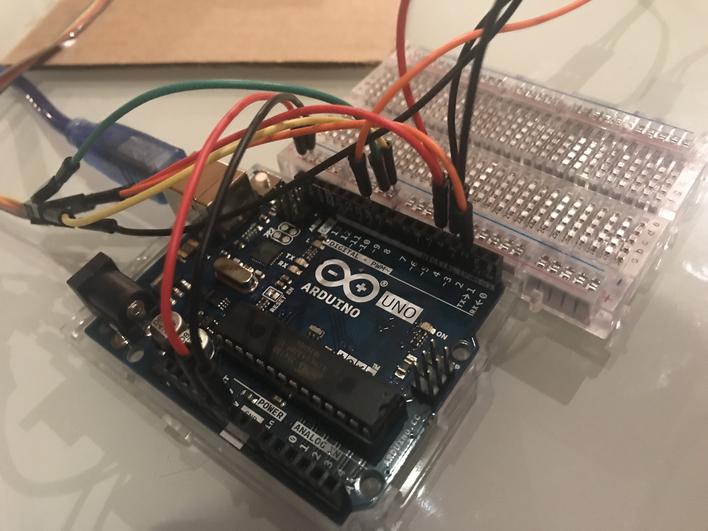

# Exploring the world of nodebots


This repo is for those who are interested in getting started with NodeBots and don't know where to go. I'm here for you. 🤗 I've included the hardware I used, website links, and files to get you going.

## Hardware List

| Part                 | Source                                                                                                                                                                                                                          | Price |
| -------------------- | ------------------------------------------------------------------------------------------------------------------------------------------------------------------------------------------------------------------------------- | ----: |
| Arduino Uno Board    | [Arduino Website](https://store.arduino.cc/usa/arduino-uno-rev3)                                                                                                                                                                |  \$22 |
| Freenove Starter Kit | [Freenove Starter Kit](https://www.amazon.com.au/Freenove-Processing-Oscilloscope-Voltmeter-Components/dp/B0721B8228/ref=sr_1_1?keywords=freenove+arduino+uno+starter+kit&qid=1576150765&s=electronics&sr=1-1)                  |  \$34 |
| MAX7219              | [Core Electronics](https://core-electronics.com.au/max7219-serial-dot-matrix-display-module.html?utm_source=google_shopping&gclid=Cj0KCQiA89zvBRDoARIsAOIePbAXJEz5XoxHO6AphZslLSmZa0pKvgWOEl_RVlhKaETziobAFN6c6OoaAh0bEALw_wcB) |  \$10 |

### Experience so far:

- I purchased an [Arduino Website](https://store.arduino.cc/usa/arduino-uno-rev3) board online, and after realizing I had no way to plug it into my computer also bought a [Freenove Starter Kit](https://www.amazon.com.au/Freenove-Processing-Oscilloscope-Voltmeter-Components/dp/B0721B8228/ref=sr_1_1?keywords=freenove+arduino+uno+starter+kit&qid=1576150765&s=electronics&sr=1-1) (\$34) as well.
- I familiarized myself with [Arduino Uno projects](https://electronicsforu.com/arduino-projects-ideas) to see what’s [possible](https://howtomechatronics.com/arduino-projects/) in [general](https://circuitdigest.com/arduino-projects).
- I googled some youtube video’s on how to connect a board and make it into a phone
- I attended a saturday’s hackers session at [Connected Community Hackerspace](https://www.hackmelbourne.org/) where I learned the basics of [Ohm’s Law](https://en.wikipedia.org/wiki/Ohm%27s_law) (electricity) and saw people building and driving around machine learning car robots.
- There I did the “hello world” of arduino boards and made an led light turn on through the circuit board
- I’ve looked through the Arduino library for some examples of different projects to build but realized they’re in C++ and I’m wanting to use node.js

### Next steps:

- I understand that [Johnny-Five](http://johnny-five.io/) is a great site for documentation and the community is really friendly so I’ll try and start there as a guide
  - I join the [Gitter chat group](https://gitter.im/rwaldron/johnny-five) for more support
- I was also referred to [Node-Ardx](http://node-ardx.org/) as a place for node.bot newbies to start from people at Hackerspace Melbourne.
- Figure out all the hardware I need and what I need to purchase, I believe I need a [GSM](https://www.arduino.cc/en/Guide/ArduinoGSMShield) (\$40 (and this hobby is starting to get expensive))

## How to start a NodeBot project

### Node Setup

If you don't have Node installed, go to the [Node.js](https://nodejs.org/en/) site and grab the latest version.

Once you've gotten Node installed, the next step differs depending on if you're using Mac OS or Windows.

### Hardware Setup

Insert the shorter end of your led light into "GND" (short for ground) and the longer end into "13".

Plug the arduino into the computer using the USB.

### Firmware Setup

Download the [Arduino IDE](https://www.arduino.cc/en/main/software)

Go to the [Johnn-Five website](http://johnny-five.io/). And follow their "Hello World!" steps. Step 2, setup your board, was tricky for me. I first went to this site that they refer you to([Firmata Arduino Github](https://github.com/firmata/arduino)) but found this page on Instructables to download [Standard-Firmata](https://www.instructables.com/id/Arduino-Installing-Standard-Firmata/
http://firmata.org/wiki/Main_Page) the screenshots easier to follow.

I also ran into issues with my OS not allowing me to install the test from an unidentified developer, so this site was helpful on unlocking me security settings. [How to install programs from unidentified developers](https://kb.wisc.edu/25443)

Install [node-gyp](https://github.com/nodejs/node-gyp) which "is a cross-platform command-line tool written in Node.js for compiling native addon modules for Node.js."
`npm install -g node-gyp`

Make a directory

Create a node project  
`node init`

Install the Johnny-Five dependency  
`npm install johnny-five`

Clone this repo into your directory of choice by typing the following:
`git clone git@github.com:nikkiricks/Node_Bots.git`

Navigate into the folder, you're going to have to install your dependencies.  
`npm install`

In your CLI type:  
`node blink.js`

Then in the terminal:  
`node blink.js`

## How to make a button controlled servo with a led-matrix condition


Familiarize yourself with the Johnny-Five [servo docs](http://johnny-five.io/examples/servo/) and the [led-matrix docs](http://johnny-five.io/examples/led-matrix/).

The led-matrix was a bit tricky for me to set up. I needed to buy one with the [MAX7219](https://core-electronics.com.au/max7219-serial-dot-matrix-display-module.html?utm_source=google_shopping&gclid=Cj0KCQiA89zvBRDoARIsAOIePbAXJEz5XoxHO6AphZslLSmZa0pKvgWOEl_RVlhKaETziobAFN6c6OoaAh0bEALw_wcB). Also, pay attention to where the "GND" "VCC" "CS" etc. are written as I noticed different boards had them in different places and if you're a newbie like me, you will follow the instructions without looking at what is what.

With the base understanding of ground and volt, I wired both the servo and matrix through a breadboard:



I then took the code from the led-matrix docs and added it to the "up-button" condition statement in the `now.js` file:

```
//for servo
const {Board, Servo} = require("johnny-five");
const keypress = require("keypress");
keypress(process.stdin);
const board = new Board();
//for matrix (may not need both?)
var five = require("johnny-five");
// is this a problem that there are two boards?
// var board = new five.Board();

board.on("ready", function() {
  // insert code for servo
  console.log("Use Up and Down arrows for CW and CCW respectively. Space to stop.");

  const servo = new Servo.Continuous(10);

  process.stdin.resume();
  process.stdin.setEncoding("utf8");
  process.stdin.setRawMode(true);

  process.stdin.on("keypress", (ch, key) => {

    if (!key) {
      return;
    }

    if (key.name === "q") {
      console.log("Quitting");
      process.exit();
    } else if (key.name === "up") {
      console.log("CW");
      servo.cw();

      var matrix = new five.Led.Matrix({
        pins: {
          data: 2,
          clock: 3,
          cs: 4
        }
      });

      matrix.on();

      var msg = " NOW".split("");

      // Display each letter for 2 seconds
      function next() {
        var c;

        if (c = msg.shift()) {
          matrix.draw(c);
          setTimeout(next, 2000);
        }
      }

      next();
    } else if (key.name === "down") {
      console.log("CCW");
      servo.ccw();
    } else if (key.name === "space") {
      console.log("Stopping");
      servo.stop();
    }
  });
})
```

## Links to more advanced projects

- [Sloane Phone NodeBot Repo](https://github.com/nikkiricks/Sloane-Phone-Node)
- [Sloane Phone C++ Repo](https://github.com/nikkiricks/Sloane-Phone-Arduino)

## Resources

- [npm keypress](https://www.npmjs.com/package/keypress) is helpful to use your keyboard as a controller. For example in the [Servo Continuous tutorial](http://johnny-five.io/examples/servo-continuous/) you require keypress and use the the up and down arrows, space bar, and q to control the servo.

- Sending SMS from Arduino over internet on [instructables](https://www.instructables.com/id/Send-SMS-from-Arduino-over-the-Internet-using-ENC2/)

- Set up node.js using the Johnny5 tutorials, configure any necessary settings
  - Use the [getting started wiki](https://github.com/rwaldron/johnny-five/wiki/Getting-Started)
